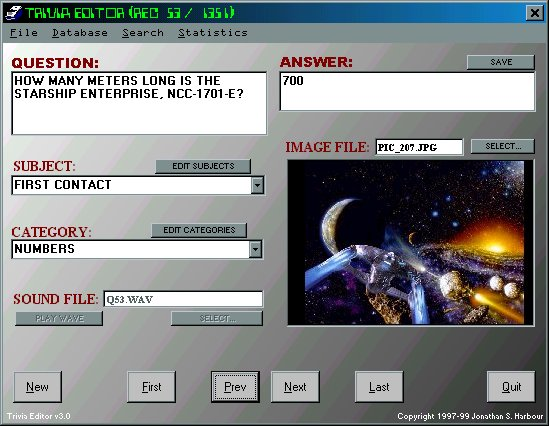



## Ultimate Star Trek Trivia

### Description

Welcome to Ultimate Star Trek Trivia, the most advanced, versatile Star Trek trivia game in the world! Prepare yourself for a rich multimedia experience as you delve into the depths of fandom knowledge and immerse yourself in the most rewarding trivia experience ever created. Over 1,400 questions. Over 400 pictures. Dozens of sound and music clips from the weekly episodes and all nine movies! This program will provide Trekkers with endless hours of enjoyment as they explore the depths of their knowledge of Star Trek. This program was once sold as shareware. But in the spirit of the open source community, the source code and all multimedia content is being released to the public by the author. (Note this is a 5Mb download)
 
### More Info
 

             |
---                |---
**Submitted On**   |2000-03-07 15:12:58
**By**             |[Jonathan S\. Harbour](https://github.com/Planet-Source-Code/PSCIndex/blob/master/ByAuthor/jonathan-s-harbour.md)
**Level**          |Advanced
**User Rating**    |4.8 (19 globes from 4 users)
**Compatibility**  |VB 5\.0, VB 6\.0
**Category**       |[Games](https://github.com/Planet-Source-Code/PSCIndex/blob/master/ByCategory/games__1-38.md)
**World**          |[Visual Basic](https://github.com/Planet-Source-Code/PSCIndex/blob/master/ByWorld/visual-basic.md)
**Archive File**   |[CODE\_UPLOAD3875382000\.zip](https://github.com/Planet-Source-Code/jonathan-s-harbour-ultimate-star-trek-trivia__1-6471/archive/master.zip)

